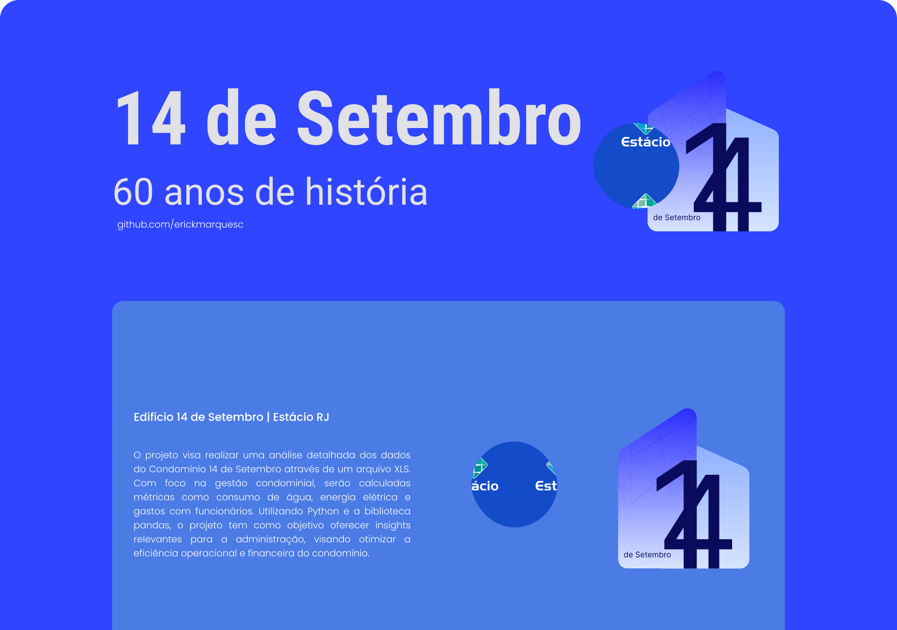

<h1 align="center">14Py</h1>

Erick Marques Cabral

Esse projeto é um trabalho de extensão, promovido pela Universidade Estácio RJ para o curso Análise e Desenvolvimento de Sistemas.  
<a href="https://estacio.br/cursos/graduacao/analise-e-desenvolvimento-de-sistemas">Estácio🔗</a>.

  

  <a href="#-descrição">Descrição do Projeto</a>&nbsp;&nbsp;&nbsp;|&nbsp;&nbsp;&nbsp;
  <a href="#-tecnologias">Tecnologias</a>&nbsp;&nbsp;&nbsp;|&nbsp;&nbsp;&nbsp;

  

## 💻 Descrição
O projeto visa realizar uma análise detalhada dos dados do Condomínio 14 de Setembro através de um arquivo XLS. Com foco na gestão condominial, serão calculadas métricas como consumo de água, energia elétrica e gastos com funcionários. 
Utilizando Python e a biblioteca pandas, o projeto tem como objetivo oferecer insights relevantes para a administração, visando otimizar a eficiência operacional e financeira do condomínio.
Apesar de serem poucas funcionalidades a aplicação contém as seguintes funcionalidades:

- Listar gastos com contas de Água e Luz
- Mostrar gasto de forma total e por unidades
- Ler um arguivo xls para ter dados
- Gerar um gráfico
- Exibir o total de valores com gasto de funcionários 

## 🚀 Tecnologias
Esse projeto foi desenvolvido com as seguintes tecnologias:

- Python
- Pandas
